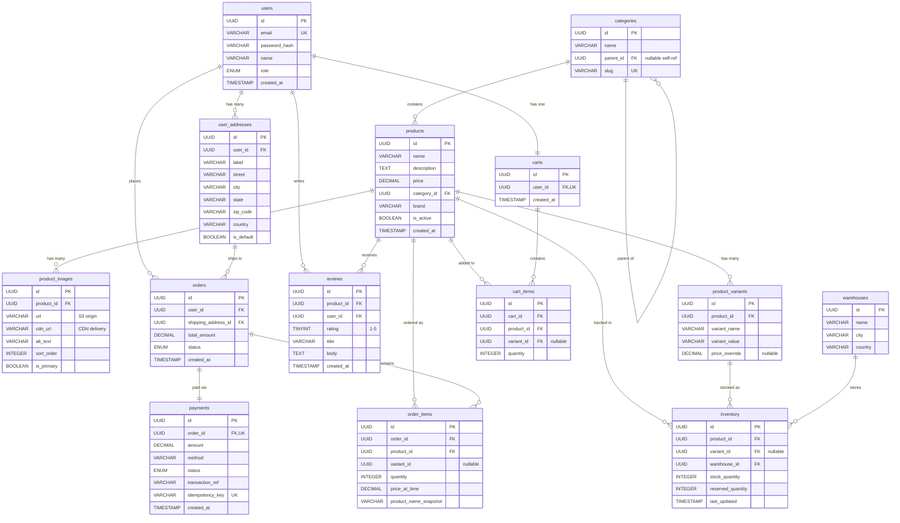
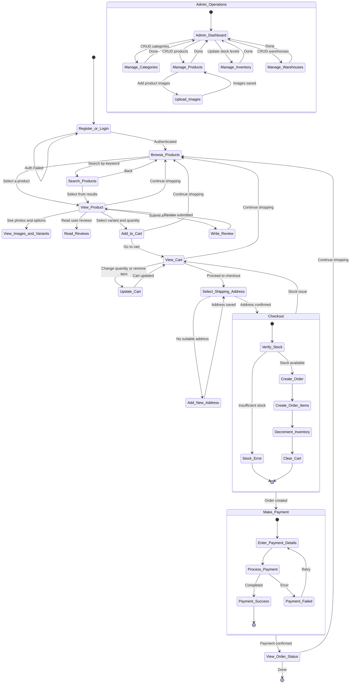

# Database Project Proposal: E-Commerce Platform

---

## Group Information

- **Group Name:** [Your Group Name]
- **Members:**
  -  Na Yanxi
  -  Li Fangyi

---

## 1. Project Description

This project implements a **simplified E-Commerce Platform** inspired by online marketplaces such as Amazon and Flipkart.

### User Features:
The application provides a **web-based interface** that allows users to perform core online shopping operations.

* Register an account
* Browse and search a product catalog
* View detailed product information, including:
  * Multiple product images
  * Variant options
* Manage a shopping cart
* Place orders with address selection
* Process payments
* Track order status

### Administrative Features:
An **administrative interface** allows privileged users to manage:

* Products
* Categories
* Inventory
* Warehouses

### Database:
All operations are backed by a **MySQL relational database** that ensures data integrity through:

* Foreign key constraints
* Transactions
* Indexing

### System Capabilities

The application demonstrates full **CRUD functionality** across all major entities in the system, driven by user interactions throughout the platform.

---


## 2. Data Description

The database consists of **14 entities** organized across five logical domains: User Management, Product Catalog, Inventory, Shopping Cart, and Orders & Payments. Below is a textual description of each entity, its attributes, and how entities relate to one another.

### 2.1 Entities and Attributes

**Users**
Stores registered user accounts. Each user has a unique `id` (UUID, primary key), an `email` (unique, used for login), a `password_hash` for authentication, a display `name`, a `role` field distinguishing customers from admins, and a `created_at` timestamp. A user may be either a customer who shops on the platform or an admin who manages product listings and inventory.

**User_Addresses**
Stores shipping and billing addresses. Each address has an `id` (UUID, primary key), a `user_id` (foreign key referencing Users), and fields for `label` (e.g., "Home", "Work"), `street`, `city`, `state`, `zip_code`, `country`, and an `is_default` flag indicating the user's preferred address. A single user can have many addresses, but each address belongs to exactly one user.

**Categories**
Organizes products into a hierarchy. Each category has an `id` (UUID, primary key), a `name`, a `slug` (unique, URL-friendly identifier), and an optional `parent_id` (foreign key referencing Categories itself). This self-referencing relationship allows nested categories such as Electronics → Phones → Smartphones. A category can have zero or many subcategories, and each subcategory has at most one parent.

**Products**
Stores the core product catalog. Each product has an `id` (UUID, primary key), a `name`, a `description` (longer text), a base `price`, a `category_id` (foreign key referencing Categories), a `brand`, an `is_active` flag for soft-deletion, and a `created_at` timestamp. Each product belongs to exactly one category, but a category can contain many products.

**Product_Images**
Stores image metadata for products. Actual image files are stored externally (e.g., on S3 or a file server) and served via a CDN; only the URLs and metadata reside in the database. Each record has an `id` (UUID, primary key), a `product_id` (foreign key referencing Products), a `url` (origin file path), a `cdn_url` (CDN delivery URL), `alt_text` for accessibility, a `sort_order` for display sequencing, and an `is_primary` flag. A product can have many images, but each image belongs to one product.

**Product_Variants**
Represents purchasable variations of a product such as size or color. Each variant has an `id` (UUID, primary key), a `product_id` (foreign key referencing Products), a `variant_name` (e.g., "Size", "Color"), a `variant_value` (e.g., "XL", "Red"), and a nullable `price_override` if the variant costs differently from the base price. A product can have many variants; each variant belongs to one product.

**Reviews**
Stores user-submitted product reviews. Each review has an `id` (UUID, primary key), a `product_id` (foreign key referencing Products), a `user_id` (foreign key referencing Users), a `rating` (integer 1–5), a `title`, a `body` (longer text), and a `created_at` timestamp. A product can receive many reviews and a user can write many reviews, but each review is tied to exactly one product and one user.

**Warehouses**
Represents physical storage locations. Each warehouse has an `id` (UUID, primary key), a `name`, a `city`, and a `country`. Warehouses exist independently and are referenced by inventory records.

**Inventory**
Tracks stock levels per product (or variant) per warehouse. Each record has an `id` (UUID, primary key), a `product_id` (foreign key referencing Products), a nullable `variant_id` (foreign key referencing Product_Variants), a `warehouse_id` (foreign key referencing Warehouses), a `stock_quantity` (available units), a `reserved_quantity` (units held during checkout), and a `last_updated` timestamp. A product can have many inventory records across different warehouses, and each warehouse stores inventory for many products.

**Carts**
Represents a user's active shopping cart. Each cart has an `id` (UUID, primary key), a `user_id` (foreign key referencing Users, unique — one cart per user), and a `created_at` timestamp. Each user has exactly one cart, and each cart belongs to exactly one user.

**Cart_Items**
Stores individual items within a cart. Each record has an `id` (UUID, primary key), a `cart_id` (foreign key referencing Carts), a `product_id` (foreign key referencing Products), a nullable `variant_id` (foreign key referencing Product_Variants), and a `quantity`. A cart can contain many items; each cart item references one product.

**Orders**
Represents a completed purchase. Each order has an `id` (UUID, primary key), a `user_id` (foreign key referencing Users), a `shipping_address_id` (foreign key referencing User_Addresses), a `total_amount`, a `status` (pending, paid, shipped, delivered, or cancelled), and a `created_at` timestamp. A user can place many orders, and each order ships to one address.

**Order_Items**
Stores the line items of an order as a snapshot at the time of purchase. Each record has an `id` (UUID, primary key), an `order_id` (foreign key referencing Orders), a `product_id` (foreign key referencing Products), a nullable `variant_id`, a `quantity`, a `price_at_time` (the price captured at purchase), and a `product_name_snapshot` (the product name captured at purchase, so the order history remains accurate even if the product is later renamed or removed). An order contains one or more order items.

**Payments**
Tracks payment transactions. Each payment has an `id` (UUID, primary key), an `order_id` (foreign key referencing Orders, unique — one payment per order), an `amount`, a `method` (e.g., credit card, PayPal), a `status` (pending, completed, failed, refunded), a `transaction_ref` (external gateway reference), an `idempotency_key` (unique, prevents duplicate charges on retry), and a `created_at` timestamp. Each order has exactly one payment, and each payment belongs to one order.

### 2.2 Relationships and Multiplicity

| Entity A | Entity B | Multiplicity | Description |
|---|---|---|---|
| Users | User_Addresses | 1 : 0..* | A user can have zero or many addresses |
| Users | Carts | 1 : 1 | Each user has exactly one cart |
| Users | Orders | 1 : 0..* | A user can place many orders |
| Users | Reviews | 1 : 0..* | A user can write many reviews |
| Categories | Categories | 0..1 : 0..* | Self-referencing hierarchy (parent → children) |
| Categories | Products | 1 : 0..* | A category contains many products |
| Products | Product_Images | 1 : 0..* | A product has many images (stored on CDN) |
| Products | Product_Variants | 1 : 0..* | A product has many variants (size, color, etc.) |
| Products | Reviews | 1 : 0..* | A product receives many reviews |
| Products | Inventory | 1 : 0..* | A product is tracked across many warehouses |
| Products | Cart_Items | 1 : 0..* | A product can be in many carts |
| Products | Order_Items | 1 : 0..* | A product can appear in many orders |
| Product_Variants | Inventory | 1 : 0..* | Each variant is stocked per warehouse |
| Warehouses | Inventory | 1 : 0..* | A warehouse stores many inventory records |
| Carts | Cart_Items | 1 : 0..* | A cart contains many items |
| Orders | Order_Items | 1 : 1..* | An order contains at least one item |
| Orders | Payments | 1 : 1 | Each order has exactly one payment |
| User_Addresses | Orders | 1 : 0..* | An address can be used for many orders |

---

## 3. SQL vs. NoSQL Storage

**Choice: SQL (MySQL 8.0 — Relational Database)**

The e-commerce domain is well-suited to a relational database for the following reasons:

- **Structured, well-defined schema.** The entities (users, products, orders) and their relationships are clearly defined upfront and unlikely to change frequently. A relational model naturally maps to this structure.
- **ACID transactions.** The checkout workflow requires atomicity: decrementing inventory, creating an order, clearing the cart, and recording a payment must either all succeed or all fail. MySQL provides robust transaction support with `BEGIN`, `COMMIT`, and `ROLLBACK` that ensures data consistency.
- **Referential integrity.** Foreign key constraints enforce that an order item always references a valid product, a cart always belongs to a valid user, and so on. This prevents orphaned or inconsistent records.
- **Query power.** SQL joins and aggregations make it straightforward to answer questions like "show me all orders for a user with their items and payment status" or "which products in a category have low stock across all warehouses."

A NoSQL database like MongoDB could offer schema flexibility for varied product attributes, but for the scope and goals of this project, MySQL provides the right balance of integrity, query expressiveness, and alignment with the database concepts covered in this course.

---

## 4. Software, Languages, Libraries, and Hardware

| Component | Technology |
|---|---|
| **Database** | MySQL 8.0 (Relational DBMS) |
| **Programming Language** | Python 3.10+ |
| **Database Connector** | mysql-connector-python |
| **Web Framework** | Flask (lightweight web framework) |
| **Frontend** | HTML, CSS, JavaScript with Jinja2 templates |
| **Diagramming Tools** | draw.io for UML and ERD |
| **IDE** | VS Code / PyCharm |
| **Version Control** | Git / GitHub |
| **OS Compatibility** | Cross-platform (Windows, macOS, Linux) |

**Machine Restrictions:** None. MySQL Community Edition and Python/Flask run on all major operating systems. A local MySQL server instance is sufficient for development and demonstration. No cloud services or paid software are required.

---

## 5. Why This Project Interests Us

E-commerce platforms are among the most data-intensive applications in the world. Platforms like Amazon and Flipkart handle millions of users, products, and transactions daily, making them a rich domain for database design.

This project interests us because it provides an opportunity to design a real-world relational schema that balances normalization with practical query performance. The checkout workflow in particular presents interesting challenges around transactional integrity — ensuring that inventory is correctly decremented, orders are created atomically, and payments are tracked reliably without double-charging.

Additionally, this domain touches on nearly every core database concept covered in this course: entity-relationship modeling, normalization, SQL joins and subqueries, indexing strategies, foreign key constraints, and concurrent access control. The multi-image and multi-warehouse dimensions add realistic complexity beyond a simple CRUD application, making it an ideal hands-on learning experience.

---

## 6. UML Conceptual Design (ERD)

The Entity-Relationship Diagram below illustrates the conceptual design of the database. It shows all 14 entities with their attributes, primary keys (PK), foreign keys (FK), and the multiplicity of each relationship.

**To view or edit this diagram:**
1. Go to [app.diagrams.net/?p=sql](https://app.diagrams.net/?splash=0&p=sql) (loads the SQL plugin)
2. Click **Arrange → Insert → Advanced → SQL**
3. Paste the SQL DDL below and click **Insert MySQL**
4. All 14 tables appear with columns, types, and keys — drag to arrange, then draw relationship lines

### SQL DDL (also serves as the ERD source)

```sql
CREATE TABLE users (
    id CHAR(36) PRIMARY KEY,
    email VARCHAR(255) NOT NULL UNIQUE,
    password_hash VARCHAR(255) NOT NULL,
    name VARCHAR(100) NOT NULL,
    role ENUM('customer', 'admin') NOT NULL DEFAULT 'customer',
    created_at TIMESTAMP NOT NULL DEFAULT CURRENT_TIMESTAMP
);

CREATE TABLE user_addresses (
    id CHAR(36) PRIMARY KEY,
    user_id CHAR(36) NOT NULL,
    label VARCHAR(50) NOT NULL,
    street VARCHAR(255) NOT NULL,
    city VARCHAR(100) NOT NULL,
    state VARCHAR(100) NOT NULL,
    zip_code VARCHAR(20) NOT NULL,
    country VARCHAR(100) NOT NULL,
    is_default BOOLEAN NOT NULL DEFAULT FALSE,
    FOREIGN KEY (user_id) REFERENCES users(id) ON DELETE CASCADE
);

CREATE TABLE categories (
    id CHAR(36) PRIMARY KEY,
    name VARCHAR(100) NOT NULL,
    parent_id CHAR(36) NULL,
    slug VARCHAR(100) NOT NULL UNIQUE,
    FOREIGN KEY (parent_id) REFERENCES categories(id) ON DELETE SET NULL
);

CREATE TABLE products (
    id CHAR(36) PRIMARY KEY,
    name VARCHAR(255) NOT NULL,
    description TEXT,
    price DECIMAL(10,2) NOT NULL,
    category_id CHAR(36) NOT NULL,
    brand VARCHAR(100),
    is_active BOOLEAN NOT NULL DEFAULT TRUE,
    created_at TIMESTAMP NOT NULL DEFAULT CURRENT_TIMESTAMP,
    FOREIGN KEY (category_id) REFERENCES categories(id) ON DELETE RESTRICT
);

CREATE TABLE product_images (
    id CHAR(36) PRIMARY KEY,
    product_id CHAR(36) NOT NULL,
    url VARCHAR(500) NOT NULL,
    cdn_url VARCHAR(500) NOT NULL,
    alt_text VARCHAR(255),
    sort_order INTEGER NOT NULL DEFAULT 0,
    is_primary BOOLEAN NOT NULL DEFAULT FALSE,
    FOREIGN KEY (product_id) REFERENCES products(id) ON DELETE CASCADE
);

CREATE TABLE product_variants (
    id CHAR(36) PRIMARY KEY,
    product_id CHAR(36) NOT NULL,
    variant_name VARCHAR(100) NOT NULL,
    variant_value VARCHAR(100) NOT NULL,
    price_override DECIMAL(10,2) NULL,
    FOREIGN KEY (product_id) REFERENCES products(id) ON DELETE CASCADE
);

CREATE TABLE reviews (
    id CHAR(36) PRIMARY KEY,
    product_id CHAR(36) NOT NULL,
    user_id CHAR(36) NOT NULL,
    rating TINYINT NOT NULL CHECK (rating BETWEEN 1 AND 5),
    title VARCHAR(255),
    body TEXT,
    created_at TIMESTAMP NOT NULL DEFAULT CURRENT_TIMESTAMP,
    FOREIGN KEY (product_id) REFERENCES products(id) ON DELETE CASCADE,
    FOREIGN KEY (user_id) REFERENCES users(id) ON DELETE CASCADE
);

CREATE TABLE warehouses (
    id CHAR(36) PRIMARY KEY,
    name VARCHAR(100) NOT NULL,
    city VARCHAR(100) NOT NULL,
    country VARCHAR(100) NOT NULL
);

CREATE TABLE inventory (
    id CHAR(36) PRIMARY KEY,
    product_id CHAR(36) NOT NULL,
    variant_id CHAR(36) NULL,
    warehouse_id CHAR(36) NOT NULL,
    stock_quantity INTEGER NOT NULL DEFAULT 0,
    reserved_quantity INTEGER NOT NULL DEFAULT 0,
    last_updated TIMESTAMP NOT NULL DEFAULT CURRENT_TIMESTAMP ON UPDATE CURRENT_TIMESTAMP,
    FOREIGN KEY (product_id) REFERENCES products(id) ON DELETE CASCADE,
    FOREIGN KEY (variant_id) REFERENCES product_variants(id) ON DELETE CASCADE,
    FOREIGN KEY (warehouse_id) REFERENCES warehouses(id) ON DELETE RESTRICT
);

CREATE TABLE carts (
    id CHAR(36) PRIMARY KEY,
    user_id CHAR(36) NOT NULL UNIQUE,
    created_at TIMESTAMP NOT NULL DEFAULT CURRENT_TIMESTAMP,
    FOREIGN KEY (user_id) REFERENCES users(id) ON DELETE CASCADE
);

CREATE TABLE cart_items (
    id CHAR(36) PRIMARY KEY,
    cart_id CHAR(36) NOT NULL,
    product_id CHAR(36) NOT NULL,
    variant_id CHAR(36) NULL,
    quantity INTEGER NOT NULL DEFAULT 1,
    FOREIGN KEY (cart_id) REFERENCES carts(id) ON DELETE CASCADE,
    FOREIGN KEY (product_id) REFERENCES products(id) ON DELETE CASCADE,
    FOREIGN KEY (variant_id) REFERENCES product_variants(id) ON DELETE SET NULL
);

CREATE TABLE orders (
    id CHAR(36) PRIMARY KEY,
    user_id CHAR(36) NOT NULL,
    shipping_address_id CHAR(36) NOT NULL,
    total_amount DECIMAL(10,2) NOT NULL,
    status ENUM('pending', 'paid', 'shipped', 'delivered', 'cancelled') NOT NULL DEFAULT 'pending',
    created_at TIMESTAMP NOT NULL DEFAULT CURRENT_TIMESTAMP,
    FOREIGN KEY (user_id) REFERENCES users(id) ON DELETE RESTRICT,
    FOREIGN KEY (shipping_address_id) REFERENCES user_addresses(id) ON DELETE RESTRICT
);

CREATE TABLE order_items (
    id CHAR(36) PRIMARY KEY,
    order_id CHAR(36) NOT NULL,
    product_id CHAR(36) NOT NULL,
    variant_id CHAR(36) NULL,
    quantity INTEGER NOT NULL,
    price_at_time DECIMAL(10,2) NOT NULL,
    product_name_snapshot VARCHAR(255) NOT NULL,
    FOREIGN KEY (order_id) REFERENCES orders(id) ON DELETE CASCADE,
    FOREIGN KEY (product_id) REFERENCES products(id) ON DELETE RESTRICT
);

CREATE TABLE payments (
    id CHAR(36) PRIMARY KEY,
    order_id CHAR(36) NOT NULL UNIQUE,
    amount DECIMAL(10,2) NOT NULL,
    method VARCHAR(50) NOT NULL,
    status ENUM('pending', 'completed', 'failed', 'refunded') NOT NULL DEFAULT 'pending',
    transaction_ref VARCHAR(255),
    idempotency_key VARCHAR(255) NOT NULL UNIQUE,
    created_at TIMESTAMP NOT NULL DEFAULT CURRENT_TIMESTAMP,
    FOREIGN KEY (order_id) REFERENCES orders(id) ON DELETE RESTRICT
);
```

### Mermaid ERD (for visual rendering)

The following Mermaid diagram can be rendered at [mermaid.live](https://mermaid.live) or pasted into any Mermaid-compatible tool:



---

## 7. User Interaction — Activity Diagram

The following activity diagram describes the step-by-step flow a user follows when interacting with the application. It covers both the customer workflow (browsing through order tracking) and the admin workflow (product and inventory management).



### Activity Diagram — Textual Description

For clarity, here is the same flow described step by step:

| Step | Actor | Action | Database Operations |
|---|---|---|---|
| 1 | Customer | Register a new account or log in | INSERT into users / SELECT from users for auth |
| 2 | Customer | Browse product catalog or search by keyword | SELECT from products with JOIN on categories |
| 3 | Customer | View product details, images, variants, and reviews | SELECT from products, product_images, product_variants, reviews |
| 4 | Customer | Optionally write a review | INSERT into reviews |
| 5 | Customer | Select a variant and quantity, add to cart | INSERT into cart_items (or UPDATE quantity if exists) |
| 6 | Customer | View cart, update quantities, or remove items | SELECT / UPDATE / DELETE on cart_items |
| 7 | Customer | Select or add a shipping address | SELECT / INSERT on user_addresses |
| 8 | Customer | Proceed to checkout | BEGIN TRANSACTION: verify inventory, INSERT into orders and order_items, UPDATE inventory, DELETE cart_items, COMMIT |
| 9 | Customer | Enter payment details | INSERT into payments, UPDATE orders.status to 'paid' |
| 10 | Customer | View order history and track status | SELECT from orders JOIN order_items JOIN payments |
| 11 | Admin | Manage categories (create, rename, nest, delete) | INSERT / UPDATE / DELETE on categories |
| 12 | Admin | Manage products (add, edit, deactivate) | INSERT / UPDATE on products |
| 13 | Admin | Upload product images | INSERT into product_images (files stored externally) |
| 14 | Admin | Manage inventory across warehouses | UPDATE inventory stock_quantity per warehouse |

---

*Document prepared for [Course Name & Number] — [Semester, Year]*
