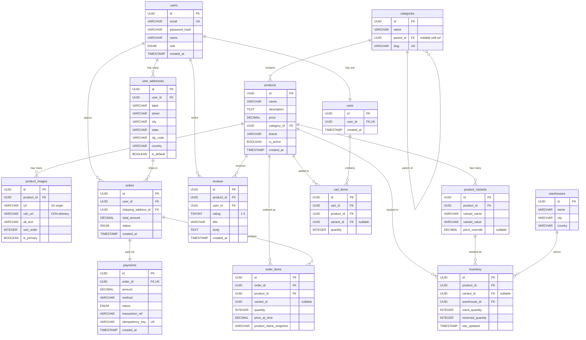
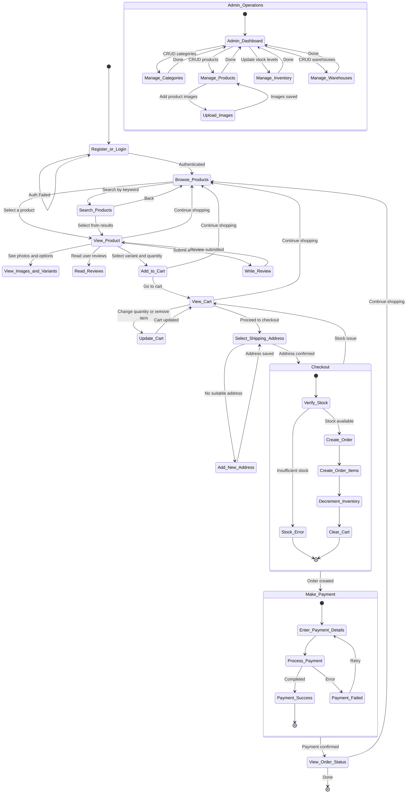

### SQL DDL (also serves as the ERD source)

```sql
CREATE TABLE users (
    id CHAR(36) PRIMARY KEY,
    email VARCHAR(255) NOT NULL UNIQUE,
    password_hash VARCHAR(255) NOT NULL,
    name VARCHAR(100) NOT NULL,
    role ENUM('customer', 'admin') NOT NULL DEFAULT 'customer',
    created_at TIMESTAMP NOT NULL DEFAULT CURRENT_TIMESTAMP
);

CREATE TABLE user_addresses (
    id CHAR(36) PRIMARY KEY,
    user_id CHAR(36) NOT NULL,
    label VARCHAR(50) NOT NULL,
    street VARCHAR(255) NOT NULL,
    city VARCHAR(100) NOT NULL,
    state VARCHAR(100) NOT NULL,
    zip_code VARCHAR(20) NOT NULL,
    country VARCHAR(100) NOT NULL,
    is_default BOOLEAN NOT NULL DEFAULT FALSE,
    FOREIGN KEY (user_id) REFERENCES users(id) ON DELETE CASCADE
);

CREATE TABLE categories (
    id CHAR(36) PRIMARY KEY,
    name VARCHAR(100) NOT NULL,
    parent_id CHAR(36) NULL,
    slug VARCHAR(100) NOT NULL UNIQUE,
    FOREIGN KEY (parent_id) REFERENCES categories(id) ON DELETE SET NULL
);

CREATE TABLE products (
    id CHAR(36) PRIMARY KEY,
    name VARCHAR(255) NOT NULL,
    description TEXT,
    price DECIMAL(10,2) NOT NULL,
    category_id CHAR(36) NOT NULL,
    brand VARCHAR(100),
    is_active BOOLEAN NOT NULL DEFAULT TRUE,
    created_at TIMESTAMP NOT NULL DEFAULT CURRENT_TIMESTAMP,
    FOREIGN KEY (category_id) REFERENCES categories(id) ON DELETE RESTRICT
);

CREATE TABLE product_images (
    id CHAR(36) PRIMARY KEY,
    product_id CHAR(36) NOT NULL,
    url VARCHAR(500) NOT NULL,
    cdn_url VARCHAR(500) NOT NULL,
    alt_text VARCHAR(255),
    sort_order INTEGER NOT NULL DEFAULT 0,
    is_primary BOOLEAN NOT NULL DEFAULT FALSE,
    FOREIGN KEY (product_id) REFERENCES products(id) ON DELETE CASCADE
);

CREATE TABLE product_variants (
    id CHAR(36) PRIMARY KEY,
    product_id CHAR(36) NOT NULL,
    variant_name VARCHAR(100) NOT NULL,
    variant_value VARCHAR(100) NOT NULL,
    price_override DECIMAL(10,2) NULL,
    FOREIGN KEY (product_id) REFERENCES products(id) ON DELETE CASCADE
);

CREATE TABLE reviews (
    id CHAR(36) PRIMARY KEY,
    product_id CHAR(36) NOT NULL,
    user_id CHAR(36) NOT NULL,
    rating TINYINT NOT NULL CHECK (rating BETWEEN 1 AND 5),
    title VARCHAR(255),
    body TEXT,
    created_at TIMESTAMP NOT NULL DEFAULT CURRENT_TIMESTAMP,
    FOREIGN KEY (product_id) REFERENCES products(id) ON DELETE CASCADE,
    FOREIGN KEY (user_id) REFERENCES users(id) ON DELETE CASCADE
);

CREATE TABLE warehouses (
    id CHAR(36) PRIMARY KEY,
    name VARCHAR(100) NOT NULL,
    city VARCHAR(100) NOT NULL,
    country VARCHAR(100) NOT NULL
);

CREATE TABLE inventory (
    id CHAR(36) PRIMARY KEY,
    product_id CHAR(36) NOT NULL,
    variant_id CHAR(36) NULL,
    warehouse_id CHAR(36) NOT NULL,
    stock_quantity INTEGER NOT NULL DEFAULT 0,
    reserved_quantity INTEGER NOT NULL DEFAULT 0,
    last_updated TIMESTAMP NOT NULL DEFAULT CURRENT_TIMESTAMP ON UPDATE CURRENT_TIMESTAMP,
    FOREIGN KEY (product_id) REFERENCES products(id) ON DELETE CASCADE,
    FOREIGN KEY (variant_id) REFERENCES product_variants(id) ON DELETE CASCADE,
    FOREIGN KEY (warehouse_id) REFERENCES warehouses(id) ON DELETE RESTRICT
);

CREATE TABLE carts (
    id CHAR(36) PRIMARY KEY,
    user_id CHAR(36) NOT NULL UNIQUE,
    created_at TIMESTAMP NOT NULL DEFAULT CURRENT_TIMESTAMP,
    FOREIGN KEY (user_id) REFERENCES users(id) ON DELETE CASCADE
);

CREATE TABLE cart_items (
    id CHAR(36) PRIMARY KEY,
    cart_id CHAR(36) NOT NULL,
    product_id CHAR(36) NOT NULL,
    variant_id CHAR(36) NULL,
    quantity INTEGER NOT NULL DEFAULT 1,
    FOREIGN KEY (cart_id) REFERENCES carts(id) ON DELETE CASCADE,
    FOREIGN KEY (product_id) REFERENCES products(id) ON DELETE CASCADE,
    FOREIGN KEY (variant_id) REFERENCES product_variants(id) ON DELETE SET NULL
);

CREATE TABLE orders (
    id CHAR(36) PRIMARY KEY,
    user_id CHAR(36) NOT NULL,
    shipping_address_id CHAR(36) NOT NULL,
    total_amount DECIMAL(10,2) NOT NULL,
    status ENUM('pending', 'paid', 'shipped', 'delivered', 'cancelled') NOT NULL DEFAULT 'pending',
    created_at TIMESTAMP NOT NULL DEFAULT CURRENT_TIMESTAMP,
    FOREIGN KEY (user_id) REFERENCES users(id) ON DELETE RESTRICT,
    FOREIGN KEY (shipping_address_id) REFERENCES user_addresses(id) ON DELETE RESTRICT
);

CREATE TABLE order_items (
    id CHAR(36) PRIMARY KEY,
    order_id CHAR(36) NOT NULL,
    product_id CHAR(36) NOT NULL,
    variant_id CHAR(36) NULL,
    quantity INTEGER NOT NULL,
    price_at_time DECIMAL(10,2) NOT NULL,
    product_name_snapshot VARCHAR(255) NOT NULL,
    FOREIGN KEY (order_id) REFERENCES orders(id) ON DELETE CASCADE,
    FOREIGN KEY (product_id) REFERENCES products(id) ON DELETE RESTRICT
);

CREATE TABLE payments (
    id CHAR(36) PRIMARY KEY,
    order_id CHAR(36) NOT NULL UNIQUE,
    amount DECIMAL(10,2) NOT NULL,
    method VARCHAR(50) NOT NULL,
    status ENUM('pending', 'completed', 'failed', 'refunded') NOT NULL DEFAULT 'pending',
    transaction_ref VARCHAR(255),
    idempotency_key VARCHAR(255) NOT NULL UNIQUE,
    created_at TIMESTAMP NOT NULL DEFAULT CURRENT_TIMESTAMP,
    FOREIGN KEY (order_id) REFERENCES orders(id) ON DELETE RESTRICT
);
```


### Mermaid ERD (for visual rendering)

The following Mermaid diagram can be rendered at [mermaid.live](https://mermaid.live) or pasted into any Mermaid-compatible tool:




